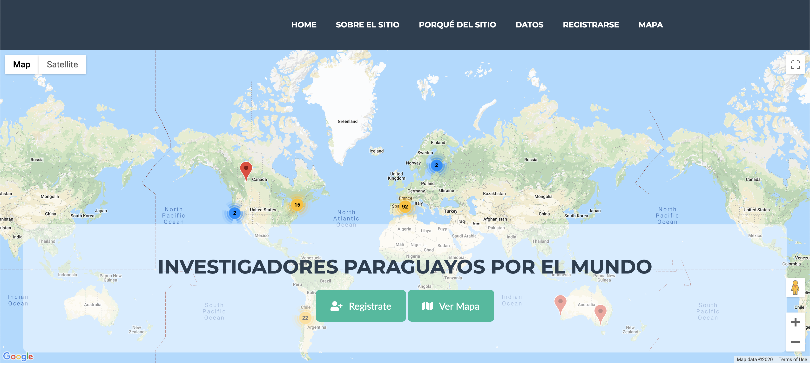
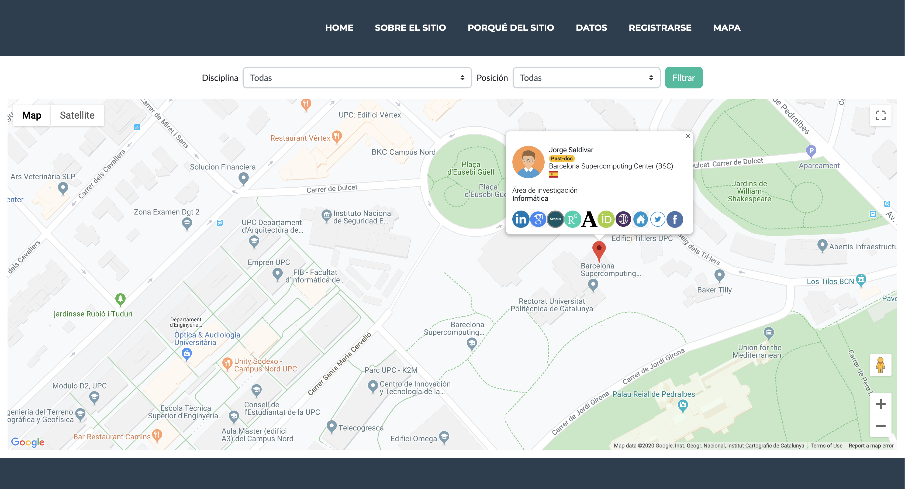

# CIPE
CIPE is a website that visualizes information of Paraguayan researchers living 
abroad and working in academia. The website shows the name, field of expertise, position 
(i.e., PhD student, postdoc, professor), and location of Paraguayans who are residing and doing 
academic research in universities, research centers, and companies abroad.

## Screenshots

## Install

1. Install docker and docker-compose in your local machine. Check the official installation [guidelines](https://docs.docker.com/install/); 
2. Obtain a google maps api key by following the instructions [here](https://developers.google.com/maps/documentation/embed/get-api-key);
3. Clone the repository `git clone https://github.com/joausaga/cipe.git`;
4. Get into the directory `cipe`;
4. Rename the file `cipe/settings.py.sample` as `cipe/settings.py`;
5. Rename the file `env.prod.db.sample` as `env.prod.db`;
6. Set the configuration parameters of the database in `env.prod.db`;
7. Rename the file `env.prod.sample` as `env.prod`;
8. Generate a random secret key to be used as part of the configuration of the tool. One way of 
generating the key is running the following command `python -c 'import random; print("".join([random.choice("abcdefghijklmnopqrstuvwxyz0123456789!@#$%^&*(-_=+)") for i in range(50)]))'`;
8. Set the SECRET_KEY and GOOGLE_MAPS_API_KEY obtained before as well as the configuration parameters 
of the database in `env.prod`;
9. Build docker container `docker-compose -f docker-compose.prod.yml up --build -d`;
10. Load initial data `docker-compose exec app python manage.py loaddata data/initial_data.json`;
11. Go to `http://localhost:1550` to access the tool

## Initial data

The website was initially preloaded with data of BECAL fellows obtained through [this request](https://informacionpublica.paraguay.gov.py/portal/#!/ciudadano/solicitud/24586) 
for  accessing public information about the [BECAL](http://www.becal.gov.py/) fellowship program.

## Technologies

1. [Python 3.6](https://www.python.org/downloads/)
2. [MySQL Community Server](https://www.mysql.com/downloads/)
3. [Django 2.2](https://www.djangoproject.com)
4. Google Maps

## Issues

Please use [Github's issue tracker](https://github.com/joausaga/cipe/issues/new) to report issues and 
suggestions.